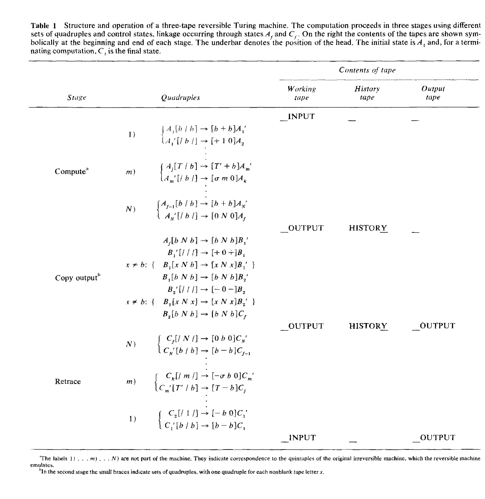
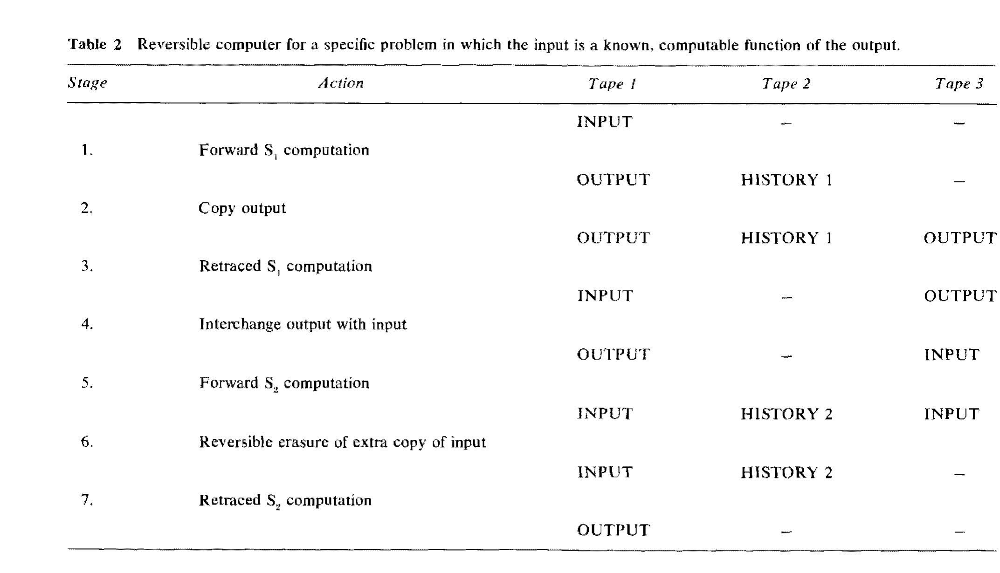

# Logical Reversibility of Computation

**C. H. Bennett**

*IBM Journal of Research and Development, November 1973, pp. 525-532.*

## Abstract

> The usual general-purpose computing automaton, for example a Turing machine, is logically irreversible: its transition function lacks a single-valued inverse. Here it is shown that such machines may be made logically reversible at every step, while retaining their simplicity and their ability to do general computations. This result is of great physical interest because it makes plausible the existence of thermodynamically reversible computers which could perform useful computations at useful speed while dissipating considerably less than $kT$ of energy per logical step. In the first stage of its computation the logically reversible automaton parallels the corresponding irreversible automaton, except that it saves all intermediate results, thereby avoiding the irreversible operation of erasure. The second stage consists of printing out the desired output. The third stage then reversibly disposes of all the undesired intermediate results by retracing the steps of the first stage in backward order, a process possible only because the first stage has been carried out reversibly, thereby restoring the machine, except for the now-written output tape, to its original condition. The final machine configuration thus contains the desired output and a reconstructed copy of the input, but no other undesired data. The foregoing results are demonstrated explicitly using a type of three-tape Turing machine. The biosynthesis of messenger RNA is discussed as a physical example of reversible computation.

> **Conversion note.** This Markdown edition is a structural conversion of the supplied scanned 8-page PDF. Running headers, footers, and page numbers are omitted. Mathematical notation uses `$...$` for inline math and `$$...$$` for display math. The two original tables are preserved as cropped images in `images/`.

[^work-note]: Much of the work on physical reversibility reported in this paper was done under the auspices of the U.S. Atomic Energy Commission while the author was employed by the Argonne National Laboratory, Argonne, Illinois.

## Introduction

The usual digital computer program frequently performs operations that seem to throw away information about the computer's history, leaving the machine in a state whose immediate predecessor is ambiguous. Such operations include erasure or overwriting of data, and entry into a portion of the program addressed by several different transfer instructions. In other words, the typical computer is logically irreversible: its transition function, the partial function that maps each whole-machine state onto its successor if the state has a successor, lacks a single-valued inverse.

Landauer [1] has posed the question of whether logical irreversibility is an unavoidable feature of useful computers, arguing that it is, and has demonstrated the physical and philosophical importance of this question by showing that whenever a physical computer throws away information about its previous state it must generate a corresponding amount of entropy. Therefore, a computer must dissipate at least $kT \ln 2$ of energy, about $3 \times 10^{-21}$ joule at room temperature, for each bit of information it erases or otherwise throws away.

An irreversible computer can always be made reversible by having it save all the information it would otherwise throw away. For example, the machine might be given an extra tape, initially blank, on which it could record each operation as it was being performed, in sufficient detail that the preceding state would be uniquely determined by the present state and the last record on the tape. However, as Landauer pointed out, this would merely postpone the problem of throwing away unwanted information, since the tape would have to be erased before it could be reused. It is therefore reasonable to demand of a useful reversible computer that, if it halts, it should have erased all its intermediate results, leaving behind only the desired output and the originally furnished input. The machine must be allowed to save its input; otherwise it could not be reversible and still carry out computations in which the input was not uniquely determined by the output. We will show that general-purpose reversible computers, namely Turing machines, satisfying these requirements indeed exist, and that they need not be much more complicated than the irreversible computers on which they are patterned. Computations on a reversible computer take about twice as many steps as on an ordinary one and may require a large amount of temporary storage. Before proceeding with the formal demonstration, the argument will be carried through at the present heuristic level.

We begin with the reversible but untidy computer mentioned earlier, which has produced, and failed to erase, a long history of its activity. Now, a tape full of random data cannot be erased except by an irreversible process; however, the history tape is not random. There exists a subtle mutual redundancy between it and the machine that produced it, which may be exploited to erase it reversibly. For example, if at the end of the computation a new stage of computation were begun using the inverse of the original transition function, the machine would begin carrying out the entire computation backward, eventually returning the history tape to its original blank condition [2]. Since the forward computation was deterministic and reversible, the backward stage would be also. Unfortunately, the backward stage would transform the output back into the original input, rendering the overall computation completely useless. Destruction of the desired output can be prevented simply by making an extra copy of it on a separate tape, after the forward stage but before the backward stage. During this copying operation, which can be done reversibly if the tape used for the copy is initially blank, the recording of the history tape is suspended. The backward stage will then destroy only the original and not the copy. At the end of the computation, the computer will contain the reconstructed original input plus the intact copy of the output; all other storage will have been restored to its original blank condition. Even though no history remains, the computation is reversible and deterministic, because each of its stages has been so.

One disadvantage of the reversible machine would appear to be the large amount of temporary storage needed for the history. For a $v$-step first stage, $v$ records of history would have to be written. In a later section it will be argued that by performing a job in many stages rather than just three, the required amount of temporary storage can often be greatly reduced. The final section discusses the possibility of reversible physical computers, capable of dissipating less than $kT$ of energy per step, using examples from the biochemical apparatus of the genetic code.

## Logically reversible Turing machines

This section formalizes the argument of the preceding section by showing that, given an ordinary Turing machine $S$, one can construct a reversible three-tape Turing machine $R$, which emulates $S$ on any standard input and which leaves behind, at the end of its computation, only that input and the desired output. The $R$ machine's computation proceeds by three stages as described above, the third stage serving to dispose of the history produced by the first. The remainder of this section may be skipped by those uninterested in the details of the proof.

The ordinary type of one-tape Turing machine [3] consists of a control unit, a read/write head, and an infinite tape divided into squares. Its behavior is governed by a finite set of transition formulas, commonly called quintuples, of the read-write-shift type. The quintuples have the form

$$
AT \to T'\,\sigma\,A',
\tag{1}
$$

meaning that if the control unit is in state $A$ and the head scans the tape symbol $T$, the head will first write $T'$ in place of $T$; then it will shift left one square, right one square, or remain where it is, according to the value of $\sigma$ (`-`, `+`, or `0`, respectively); finally the control unit will revert to state $A'$. In the usual generalization to $n$-tape machines, $T$, $T'$, and $\sigma$ are all $n$-tuples within the quintuple.

Each quintuple defines a partial one-to-one mapping of the present whole-machine state, that is, tape contents, head positions, and control state, onto its successor and, as such, is deterministic and reversible. Therefore a Turing machine will be deterministic if and only if its quintuples have non-overlapping domains, and will be reversible if and only if they have non-overlapping ranges. The former is customarily guaranteed by requiring that the portion to the left of the arrow be different for each quintuple. On the other hand, the usual Turing machine is not reversible.

In making a Turing machine reversible, we will need to add transitions that closely resemble the inverses of the transitions it already has. However, because the write and shift operations do not commute, the inverse of a read-write-shift quintuple, though it exists, is of a different type: shift-read-write. In constructing a reversible machine it is necessary to include quintuples of both types, or else to use a formalism in which transitions and their inverses have the same form. Here the latter approach is taken: the reversible machine will use a simpler type of transition formula in which, during a given transition, each tape is subjected to a read-write or to a shift operation but no tape is subjected to both.

**Definition.** A quadruple, for an $n$-tape Turing machine having one head per tape, is an expression of the form

$$
A[t_1,t_2,\ldots,t_n] \to [t'_1,t'_2,\ldots,t'_n]A',
\tag{2}
$$

where $A$ and $A'$ are positive integers denoting internal states of the control unit before and after the transition, respectively. Each $t_k$ may be either a positive integer denoting a symbol that must be read on the $k$th tape or a solidus `/`, indicating that the $k$th tape is not read during the transition. Each $t'_k$ is either a positive integer denoting the symbol to be written on the $k$th tape or a member of the set $\{-,0,+\}$ denoting a left, null, or right shift of the $k$th tape head. For each tape $k$, $t'_k \in \{-,0,+\}$ if and only if $t_k = /$. Thus the machine writes on a tape if and only if it has just read it, and shifts a tape only if it has not just read it.

Like quintuples, quadruples define mappings of the whole-machine state which are one-to-one. Any read-write-shift quintuple can be split into a read-write and a shift, both expressible as quadruples. For example, the quintuple (1) is equivalent to the pair of quadruples

$$
AT \to T'A'',
\tag{3}
$$

$$
A''[/\,\cdots\,/] \to \sigma A',
\tag{4}
$$

where $A''$ is a new control-unit state different from $A$ and $A'$. When several quintuples are so split, a different connecting state $A''$ must be used for each, to avoid introducing indeterminacy.

Quadruples have the following additional important properties, which can be verified by inspection. Let

$$
\alpha \equiv A[t_1,\ldots,t_n] \to [t'_1,\ldots,t'_n]A'
\tag{5}
$$

and

$$
\beta \equiv B[u_1,\ldots,u_n] \to [u'_1,\ldots,u'_n]B'
\tag{6}
$$

be two $n$-tape quadruples.

1. $\alpha$ and $\beta$ are mutually inverse, that is, define inverse mappings of the whole-machine state, if and only if $A = B'$ and $B = A'$ and, for every $k$, either $t_k = u_k = /$ and $t'_k = -u'_k$, or $u_k \ne /$ and $t'_k = u_k$ and $t_k = u'_k$. The inverse of a quadruple is obtained by interchanging the initial control state with the final, the read tape symbols with the written, and changing the signs of all the shifts.
2. The domains of $\alpha$ and $\beta$ overlap if and only if $A = B$ and, for every $k$, $t_k = /$ or $u_k = /$ or $t_k = u_k$. Non-overlapping domains require a differing initial control state or a differing scanned symbol on some tape read by both quadruples.
3. The ranges of $\alpha$ and $\beta$ overlap if and only if $A' = B'$ and, for every $k$, $t'_k = /$ or $u'_k = /$ or $t'_k = u'_k$. The property is analogous to the previous one, but depends on the final control state and the written tape symbols.

A reversible deterministic $n$-tape Turing machine may now be defined as a finite set of $n$-tape quadruples, no two of which overlap either in domain or range. We now wish to show that such machines can be made to emulate ordinary irreversible Turing machines. It is convenient to impose on the machines to be emulated certain format-standardization requirements, which, however, do not significantly limit their computing power [4].

**Definition.** An input or output is said to be standard when it is on otherwise blank tape and contains no embedded blanks, when the tape head scans the blank square immediately to the left of it, and when it includes only letters belonging to the tape alphabet of the machine scanning it.

**Definition.** A standard Turing machine is a finite set of one-tape quintuples of the form (1), satisfying the following requirements:

1. **Determinism.** No two quintuples agree in both $A$ and $T$.
2. **Format.** If started in control state $A_1$ on any standard input, the machine, if it halts, will halt in control state $A_f$, $f$ being the number of control states, leaving its output in standard format.
3. **Special quintuples.** The machine includes the following quintuples:

$$
A_1 b \to b + A_2,
\tag{7}
$$

$$
A_{f-1} b \to b 0 A_f,
\tag{8}
$$

and control states $A_1$ and $A_f$ appear in no other quintuple. These two are thus the first and last executed respectively in any terminating computation on a standard input. The letter $b$ represents a blank.

The phrase "machine $M$, given standard input string $I$, computes standard output string $P$" will be abbreviated $M: I \to P$. For an $n$-tape machine this will become

$$
M:(I_1;I_2;\ldots;I_n) \to (P_1;P_2;\ldots;P_n),
$$

where $I_k$ and $P_k$ are the standard input and the standard output on the $k$th tape. A blank tape will be abbreviated $B$.

The main theorem can now be stated.

**Theorem.** For every standard one-tape Turing machine $S$, there exists a three-tape reversible deterministic Turing machine $R$ such that if $I$ and $P$ are strings on the alphabet of $S$, containing no embedded blanks, then $S$ halts on $I$ if and only if $R$ halts on $(I;B;B)$, and

$$
S:I \to P
\quad\text{if and only if}\quad
R:(I;B;B) \to (I;B;P).
$$

Furthermore, if $S$ has $f$ control states, $N$ quintuples, and a tape alphabet of $z$ letters, including the blank, $R$ will have

$$
2f + 2N + 4
$$

states,

$$
4N + 2z + 3
$$

quadruples, and tape alphabets of $z$, $N+1$, and $z$ letters, respectively. Finally, if in a particular computation $S$ requires $v$ steps and uses $s$ squares of tape, producing an output of length $\lambda$, then $R$ will require

$$
4v + 4\lambda + 5
$$

steps, and use $s$, $v+1$, and $\lambda+2$ squares on its three tapes, respectively. It will later be argued that where $v \gg s$, the total space requirement can be reduced to less than $2\sqrt{vs}$.

**Proof.** To construct the machine $R$ we begin by arranging the $N$ quintuples of $S$ in some order with the standard quintuples first and last:

$$
\begin{aligned}
1)&\quad A_1 b \to b + A_2,\\
&\quad \vdots\\
m)&\quad A_j T \to T'\sigma A_k,\\
&\quad \vdots\\
N)&\quad A_{f-1}b \to b0A_f.
\end{aligned}
\tag{9}
$$

Each quintuple is now broken into a pair of quadruples as described earlier. The $m$th quintuple becomes

$$
\left\{
\begin{aligned}
A_jT &\to T'A'_m,\\
A'_m / &\to \sigma A_k.
\end{aligned}
\right.
\tag{10}
$$

The newly added states $A'_m$ are different from the old states and from each other; each $A'$ appears in only one pair of quadruples.

### Table 1. Three-tape reversible Turing machine

The original table gives the structure and operation of the three-tape reversible Turing machine. The computation proceeds in three stages using different sets of quadruples and control states, with linkage through states $A_f$ and $C_f$. On the right, the contents of the tapes are shown symbolically at the beginning and end of each stage. The underbar denotes the position of the head. The initial state is $A_1$ and, for a terminating computation, $C_1$ is the final state.

Two extra tapes are then added, one for the history and one for the duplicate copy of the output. The output, third, tape is left blank and null-shifted for the present, but the history, second, tape is used to record the index $m$ as each transition pair is executed. The $m$th pair of quadruples now has the form

$$
\left\{
\begin{aligned}
A_j[T\,/\,b] &\to [T'\,+\,b]A'_m,\\
A'_m[/\,b\,/] &\to [\sigma\,m\,0]A_k.
\end{aligned}
\right.
\tag{11}
$$

Notice that the history, second, tape is out of phase with the other two: it is written on while they are being shifted and vice versa. This phasing is necessary to assure reversibility. It serves to capture the information that would otherwise be thrown away when the specific control state $A'_m$ passes to the more general state $A_k$. The `+` shifting of the history tape assures that a blank square will always be ready to receive the next $m$ value. If the computation of $S$ does not halt, neither will that of $R$, and the machine will continue printing on the history tape indefinitely. On the other hand, if, on a standard input, $S$ halts, $R$ will eventually execute the $N$th pair of quadruples, finding itself in state $A_f$, with the output in standard format on tape 1. The history head will be scanning the number $N$ which it has just written at the extreme right end of the history on tape 2. Control then passes to the second stage of computation, which copies the output onto tape 3. The control states for this stage are denoted by $B$'s and are distinct from all the $A$-type control states. Notice that the copying process can be done reversibly without writing anything more on the history tape. This shows that the generation, or erasure, of a duplicate copy of data requires no throwing away of information.

The third stage undoes the work of the first and consists of the inverses of all first-stage transitions with $C$'s substituted for $A$'s. In the final state $C_1$, the history tape is again blank and the other tapes contain the reconstructed input and the desired output.

As Table 1 shows, the total number of control states is $2N + 2f + 4$, the number of quadruples $4N + 2z + 3$, and the space and time requirements are as stated at the beginning of the proof. The non-overlapping of the domains and ranges of all the quadruples assures determinism and reversibility of the machine $R$. In the first stage, the upper transitions of each pair do not overlap in their domains because of the postulated determinacy of the original Turing machine $S$, whose quintuples also began $A_jT \to$. The ranges of the upper quadruples, as well as the domains of the lower, are kept from overlapping by the uniqueness of the states $A'_m$. Finally, the ranges of the lower quadruples are saved from overlapping by the unique output $m$ on the history tape. The state $A_f$ causes no trouble, even though it occurs in both stage 1 and stage 2, because by the definition of the machine $S$ it does not occur on the left in stage 1; similarly for state $C_f$. The non-overlapping of the stage 2 quadruples can be verified by inspection, while the determinism and reversibility of stage 3 follow from those of stage 1.

## Discussion

The argument developed above is not limited to three-tape Turing machines, but can be applied to any sort of deterministic automaton, finite or infinite, provided it has sufficient temporary storage to record the history. One-tape reversible machines exist, but their frequent shifting between the working and history regions on the tape necessitates as many as $v^2$ steps to emulate a $v$-step irreversible computation.

In the case that $S$ is a universal Turing machine, $R$ becomes a machine for executing any computer program reversibly. For such a general-purpose machine it seems highly unlikely that we can avoid having to include the input as part of the final output. However, there are many calculations in which the output uniquely determines the input, and for such a problem one might hope to build a specific reversible computer that would simply map inputs onto outputs, erasing everything else. This is indeed possible, provided we have access to an ordinary Turing machine which, given an output, computes the corresponding input. Let $S_1$ be the irreversible Turing machine that computes the output from the input and $S_2$ be the one that computes the input from the output. The reversible computation proceeds by seven stages as shown in Table 2. The first three employ a reversible form of the $S_1$ computer and, as in Table 1, serve to map the input onto the input and output. Stage four interchanges input and output. Stages five and seven use a reversible realization of the $S_2$ computer. Stage five has the sole purpose of producing a history of the $S_2$ computation, that is, of the input from the output, which, after the extra copy of the input has been erased in stage six, is used in stage seven to destroy itself and the remaining copy of the input, while producing only the desired output.

### Table 2. Reversible computer for a specific problem

The original table shows a reversible computer for a specific problem in which the input is a known, computable function of the output.

We shall now return to the more usual situation, in which the input must be saved because it is not a known, computable function of the output. Performing a computation reversibly entails only a modest increase in computing time and machine complexity; the main drawback of reversible computers appears thus to be the large amount of temporary storage they require for the history in any long, compute-bound job, that is, one whose number of steps $v$ greatly exceeds the number of squares of memory used, $s$.

Fortunately, the temporary storage requirement can be cut down by breaking the job into a sequence of $n$ segments, each one of which would be performed and retraced, and the history tape thereby erased and made ready for reuse, before proceeding to the next. Each segment would leave on the working tape, tape 1, a restart dump that would be used as the input of the next segment; but to preserve reversibility it would also have to leave, on tape 3, say, a copy of its own input, which would in most cases simply be the preceding restart dump. At the end of the computation we would have, in addition to the original input and desired output, all the $n-1$ intermediate dumps, concatenated, for example, on tape 3. These intermediate results, which would not have been produced had the job not been segmented, either can be accepted as permanent but unwanted output in exchange for the $n$-fold reduction of the history tape, or can themselves be reversibly erased by first making an extra copy of the desired final output, putting it, say, on a previously unused part of tape 3, then reversing the whole $n$-segment computation. This reversal is possible because each segment has been performed reversibly. The sequence of restart dumps thus functions as a kind of higher-level history, and it is erased by a higher-level application of the same technique used to erase the primary histories. At the end of the computation, the machine will contain only the original input and the desired $n$th segment output, and every step of the original irreversible computation will have been performed twice forward and twice backward.

For a job with $v$ steps and a restart dump of size $s$, the total temporary storage requirement, minimized by choosing

$$
n = \sqrt{\frac{v}{s}},
$$

is

$$
2\sqrt{vs}
$$

squares, half on the history tape and half on the dump tape. A

$$
\frac{1}{2}\sqrt{\frac{v}{s}}
$$

fold reduction in space can thus be bought by a twofold increase in time, ignoring the time required to write and read restart dumps, without any unwanted output. By a systematic reversal of progressively larger nested sequences of segments one might hope to reach an absolute minimum temporary storage requirement growing only as $\log v$, for sufficiently large $v$, with the time increasing perhaps as $v^2$, because of the linearly increasing number of times each segment would have to be retraced.

It thus appears that every job of computation can be done in a logically reversible manner, without inordinate increases in machine complexity, number of steps, unwanted output, or temporary storage capacity.

## Physical reversibility

The existence of logically reversible automata suggests that physical computers might be made thermodynamically reversible, and hence capable of dissipating an arbitrarily small amount of energy per step if operated sufficiently slowly. A full treatment of physically reversible computers is beyond the scope of the present paper [5], but it is worthwhile to give a brief and non-rigorous introduction to how they might work.

An obvious approach to minimizing energy dissipation is to design the computer so that it can operate near thermodynamic equilibrium. All moving parts would then, at any instant, have near-thermal velocity, and the desired logical transitions would necessarily be accomplished by spontaneous thermally activated motion over free energy barriers not much higher than $kT$. At first sight this might seem impossible. In existing electronic computers, for example, even when a component being switched is itself nondissipative, such as a magnetic core, the switching process depends on temporarily applying a strong external force to push the component irreversibly over a high free energy barrier.

However, nature provides a beautiful example of a thermally activated "computer" in the biochemical apparatus responsible for the replication, transcription, and translation of the genetic code [6]. Each of these processes involves a long, deterministic sequence of manipulations of coded information, quite analogous to a computation, and yet, so far as is known, each is simply a sequence of coupled, thermally activated chemical reactions. In biochemical systems, enzymes play the essential role of selectively lowering the activation barriers for the desired transitions while leaving high barriers to obstruct all undesired transitions, those which in a computer would correspond to errors. Although the environment in which enzymes normally function is not at chemical equilibrium, many enzyme-catalyzed reactions are freely reversible, and one can find a set of equilibrium reactant concentrations at which both forward and reverse reactions occur equally rapidly, while competing uncatalyzed reactions have negligible rates. It is thus not unreasonable to postulate a thermally activated computer in which, at equilibrium, every logically allowed transition occurs equally often forward and backward, while illogical transitions hardly ever occur. In the following discussion chemical terminology will be used, without implying that thermally activated computers must be chemical systems.

The chemical realization of a logically reversible computation is a chain of reactions, each coupled only to the preceding one and the following one. It is helpful to think of the computing system as comprising a major reactant, analogous to DNA, that encodes the logical state, and minor reactants that react with the major one to change the logical state. Only one molecule of the major reactant is present, but the minor reactants are all present at definite concentrations, which may be manipulated to drive the computation forward or backward.

If the minor reactants are in equilibrium, and the major reactant initially corresponds to the initial state of a $p$-step computation, the system will begin a random walk through the chain of reactions, and after about $p^2$ steps will briefly visit the final state. This does not deserve to be called a computation: it would be legitimate to insist that the system proceed through the chain of reactions with some positive drift velocity and, after sufficient time, have a high probability of being in the final state, if the computation has one. The former requirement can be met by adjusting the chemical potentials of the minor reactants so that each forward step dissipates a little energy $\epsilon$; the latter can be met by dissipating a trivial extra amount during the last step. If all steps had equal dissipation, $\epsilon < kT$, the final state occupation probability would be only about $\epsilon/kT$. By dissipating an extra

$$
kT\ln\left(\frac{3kT}{\epsilon}\right)
$$

of energy during the last step, this probability is increased to about 95%. Given a uniform rate $\Gamma$ for all forward reactions, an energy dissipation $\epsilon < kT$ per step will buy a drift velocity, that is, computation speed, of

$$
\frac{\Gamma\epsilon}{kT}
$$

steps per second. On the other hand, for $\epsilon > kT$, backward steps will be effectively suppressed and the computation speed will approach the forward reaction rate $\Gamma$. The chemical system is thus a thermodynamically reversible computer of the type we have been seeking.

If we attempt to apply the preceding argument to a logically irreversible computer, we can see that here the reactions form a branching structure, with a main trunk corresponding to the desired computation path, and side branches corresponding to incorrect or "extraneous" reverse computations. The states on the side branches are valid predecessors of the final state but not valid successors of the initial state. A few such extraneous states would pose no problem: a small driving force would still suffice to push the system into the desired final state. Temporary backward excursions onto the side branches would occur, but would not lead to errors, contrary to what one might expect. Since no state of a deterministic computer can have more than one logical successor, the erroneously reversed operations would be corrected as soon as the computation proceeded forward again, and the desired path would be rejoined.

The real problem comes from the enormous number of extraneous predecessors; typically they outnumber the states on the intended computation path by hundreds of orders of magnitude. This is because, in irreversibly programmed computations, one can usually proceed backward along an extraneous path for many steps, making further wrong choices along the way, before arriving at a state that has no predecessors.

If a thermally activated computer with many extraneous states is operated close to equilibrium, the system will spend only a minuscule fraction of its time on the desired path of computation, let alone in the desired final state. An acceptable computation rate requires: first, that finite but time-consuming backward excursions be largely suppressed; and second, that infinite ones be completely suppressed. This in turn means, roughly speaking, that the dissipation per step must exceed

$$
kT\ln m,
$$

where $m$ is the mean number of immediate predecessors, either averaged over states near the intended path or averaged over all accessible states, whichever is greater. For a typical irreversible computer, which throws away about one bit per logical operation, $m$ is approximately two, and thus $kT\ln 2$ is, as Landauer has argued [1], an approximate lower bound on the energy dissipation of such machines. For a logically reversible computer, however, $m$ is exactly one by construction.

The biosynthesis and biodegradation of messenger RNA may be viewed as convenient examples of logically reversible and irreversible computation, respectively. Messenger RNA, a linear polymeric informational macromolecule like DNA, carries the genetic information from one or more genes of a DNA molecule, and serves to direct the synthesis of the proteins encoded by those genes. Messenger RNA is synthesized by the enzyme RNA polymerase in the presence of a double-stranded DNA molecule and a supply of RNA monomers, the four nucleotide pyrophosphates ATP, GTP, CTP, and UTP [7]. The enzyme attaches to a specific site on the DNA molecule and moves along, sequentially incorporating the RNA monomers into a single-stranded RNA molecule whose nucleotide sequence exactly matches that of the DNA. The pyrophosphate groups are released into the surrounding solution as free pyrophosphate molecules. The enzyme may thus be compared to a simple tape-copying Turing machine that manufactures its output tape rather than merely writing on it. Tape copying is a logically reversible operation, and RNA polymerase is both thermodynamically and logically reversible.

In the cellular environment the reaction is driven in the intended forward direction of RNA synthesis by other reactions, which maintain a low concentration of free pyrophosphate, relative to the concentrations of nucleotide pyrophosphates [8]. A high pyrophosphate concentration would drive the reaction backward, and the enzyme would carry out a sequence-specific degradation of the RNA, comparing each nucleotide with the corresponding DNA nucleotide before splitting it off. This process, which may be termed logically reversible erasure of RNA, does not normally occur in biological systems. Instead, RNA is degraded by other enzymes, such as polynucleotide phosphorylase [9], in a logically irreversible manner, that is, without checking its sequence against DNA. Polynucleotide phosphorylase catalyzes the reaction of RNA with free phosphate, maintained at high concentration, to form nucleotide phosphate monomers. Like the polymerase reaction, this reaction is thermodynamically reversible; however, because of its logical irreversibility, a fourfold greater phosphate concentration is needed to drive it forward than would be required for a logically reversible phosphorolytic degradation. The extra driving force is necessary to suppress the undesired synthesis of nonsense RNA by random polymerization.

In biological systems, apparently, the speed and flexibility of irreversible erasure outweigh its extra cost in free energy, $kT\ln 4$ per nucleotide in this case. Indeed, throughout the genetic apparatus, energy is dissipated at a rate of roughly $5$ to $50\,kT$ per step. While this is ten orders of magnitude lower than in an electronic computer, it is considerably higher than what would theoretically be possible if biochemical systems did not need to run at speeds close to the kinetic maximum, presumably to escape the harmful effects of radiation, uncatalyzed reactions, and competition from other organisms.

## Acknowledgment

I thank Rolf Landauer for raising the question of reversibility of computation in the first place and for stimulating discussions of my models.

## References and notes

1. R. Landauer, *IBM J. Res. Develop.* **3**, 183 (1961). R. W. Keyes and R. Landauer, *IBM J. Res. Develop.* **14**, 152 (1970), investigate a specific model computer whose energy dissipation per step is about $kT$.
2. R. W. Keyes, *Science* **168**, 796 (1970), in summarizing Landauer's argument [1], commented that a saved history might be used to reverse the steps of the original computation, but that this was not practical in a general purpose computer. He did not explicitly point out that a reversible machine can be made to erase its own history, an ability which, we have argued, allows it to be useful as a general purpose computer.
3. For a good informal exposition of Turing machines see Chapter 6 of M. L. Minsky, *Computation: Finite and Infinite Machines*, Prentice-Hall, Inc., Englewood Cliffs, N. J., 1967.
4. By the addition of a few extra tape symbols and quintuples, an arbitrary Turing machine can be made to obey these format requirements while computing essentially the same function as it did before. See M. Davis, *Computability and Unsolvability*, McGraw-Hill Book Co., Inc., New York, 1958, pp. 25-26.
5. The author is currently preparing a paper on physically reversible model computers.
6. For a good introduction to this subject see James D. Watson, *Molecular Biology of the Gene*, 2nd ed., W. A. Benjamin, Inc., New York, 1970.
7. Ibid., p. 336 ff.
8. Ibid., p. 155 ff.
9. Ibid., p. 403.

*Received April 12, 1973.*

*C. H. Bennett is located at the IBM Thomas J. Watson Research Center, Yorktown Heights, New York 10598.*
